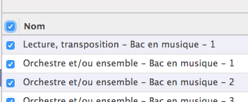
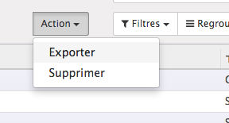
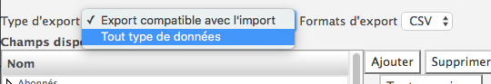
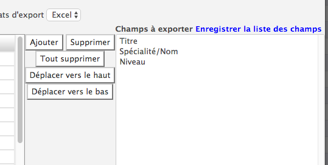

:banner: banners/db_management.jpg

===========================
Outils et gestion technique
===========================

Export de données
-----------------

L'export de données se fait à partir des vues "Liste" au moyen de l'outil 
"Export" qui se trouve dans le menu "Action" une fois que les enregistrements
désirés ont été sélectionnés.

Aller dans la vue "Liste" des éléments à eporter

Sélectionner les lignes à exporter ou sélectionner les toutes à l'aide du 
carré en haut à gauche de la liste. Dans ce cas, même si seulement 80 lignes 
sont affichées, Odoo exportera bien toutes les lignes qui sont disponibles.

.. image:: tools/image2.png

Lancer l'outil d'export

Sélectionner l'option tout type de données, sinon seules les données que 
l'on peut importer seront disponibles

Eventuellement sélectionner un export Excel plutôt que CSV et sélectionner 
les champs voulus.

Le fichier est alors téléchargé lorsqu'il est disponible.