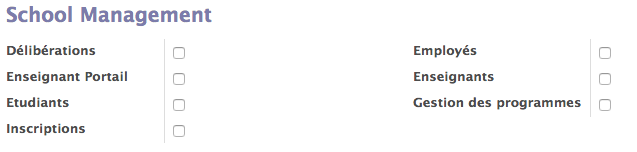

:banner: banners/users_management.jpg

========================
Gestion des utilisateurs
========================

Il existe deux grandes catégories d'utilisateurs dans Horizon, les étudiants (et
autres contacts) qui n'ont qu'un accès très restreint à l'information au travers
du portail d'accès (i.e. du Site Web) et les utilisateurs proprement dit du
système qui ont des droits d'accès plus étendus et accèdent au système au travers
des modules de gestion de l'information (Contact, Enseignement, Groupes, 
Délibération...).

Les premiers doivent être créés au travers du menu *Contact*, alors que les seconds
doivent être créés par l'administrateur au travers du menu *Configuration/Utilisateurs*.

Ajout d'un étudiant
-------------------

L'ajout d'un étudiant se fait au travers du menu *Contact/Etudiant*.

.. warning::
    Il est important de veiller à bien remplir un maximum la signalétique, en respectant
    la qualité des données entrées ("CHARLEROI" vs "Charleroi") car ces données se
    retrouveront notamment dans les documents officiels produits par le système.

L'accès au portail d'information doit être ajouté au moyen de l'action *Gestion 
de l'accès au portail*. Pour ce faire l'adresse "xxxx@crlg.be" doit impérativement
être encodée dans le champs *Courriel* de la signalétique.

L'accès peut être donné à une liste d'étudiants en une opération.

Dans la fenêtre de sélection, il faut sélectionner l'option *Autres droits 
supplémentaires/Portail Etudiants*.

L'étudiant reçoit alors un email sur sa boîte "xxxx@crlg.be" et doit suivre le
lien pour valider son accès.

Ajout d'un enseignant
---------------------

Les enseignants sont ajouté de manière identique aux étudiants, à l'exception du
type d'accès au portail à sélectionner, il faut prendre l'option 
*School Management/Enseignat Portail*.

Ajout d'un personnel administratif
----------------------------------

Le personnel administratif est lui ajouté par l'administrateur au moyen du menu
*Configuration/Utilisateurs*. La raison est un besoin de pouvoir affiner les
droits de chaque utilisateurs alors que les autres types ont tous les mêmes 
droits.

.. tip::
    Il faut veiller à remplir le champs *Année en cours*.

Il faut impérativement remplir l'adresse "xxxx@crlg.be" dans le champs *Adresse électronique*
ceci afin de permettre l'authentification *Google*.

Dans le pannel *School Management* il convient de sélectionner au minima *employé*,
mais également tous les groupes de fonctions que l'utilisateurs sera amené à utiliser.

Délibération
    Permet l'accès à l'interface de délibération.
    
Inscriptions
    Permet de modifier les programmes individuels des étudiants et ainsi gérer
    le processus d'inscription.

Gestion des programmes
    Permet de modifier la définition des programmes, des unités d'enseignement et
    des activités d'apprentissages.
    
.. tip::
    En passant en mode *developper* via le menu *A propos/Activate developper mode*
    il est aussi possible de retirer la possibilité de créer des contacts. Cette
    possibilité est assignée par défaut.
    
Une invitation à rejoindre Horizon est automatiquement envoyée à l'utilisateur
pour l'inviter à valider son compte et confirmer son accès.

Il est possible de renvoyer une invitation à partir de ce même écran si 
nécessaire.